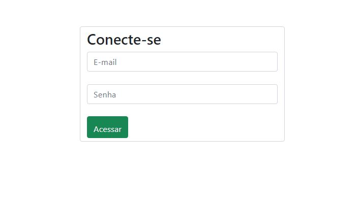
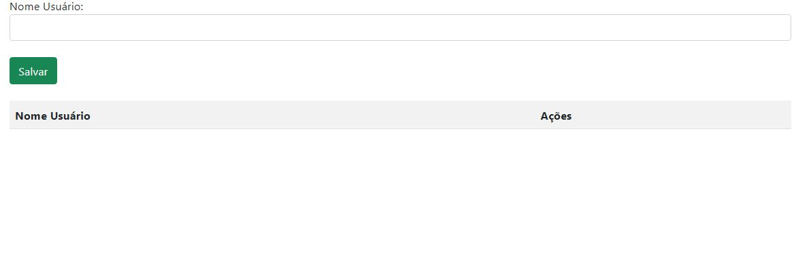

# login-cad

Este é um projeto simples de uma página web para cadastro de usuários. A aplicação permite que um usuário faça login e, em seguida, insira e exiba o nome de novos usuários em uma tabela. O projeto foi desenvolvido utilizando HTML, CSS, Bootstrap e JavaScript.

## Estrutura do Projeto

- **login.html**: Página de login que permite ao usuário inserir seu e-mail e senha para acessar a página de cadastro.
- **index.html**: Página de cadastro que contém o formulário de inserção de nomes e a tabela para exibição dos usuários cadastrados.
- **main.css**: Arquivo CSS para estilização customizada da página.
- **controler.js**: Script JavaScript responsável por gerenciar as ações da página, como validação de login, salvar os usuários, atualizar a tabela, permitir a edição ou exclusão de nomes da lista, e validar o CPF.

## Funcionalidades

- **Validação de Login**: A função `acessar()` valida se os campos de e-mail e senha foram preenchidos antes de redirecionar o usuário para a página de cadastro.

- **Cadastro de Usuário**: O usuário pode inserir nome, e-mail e CPF no formulário e salvá-los clicando no botão "Salvar". Os dados do usuário são então exibidos na tabela abaixo do formulário.

- **Validação de CPF**: Implementada validação de CPF para garantir que o número informado é válido. Caso o CPF não seja válido, o usuário será informado por meio de uma mensagem de alerta.

- **Exibição e Atualização da Lista de Usuários**: A função `criaLista()` exibe todos os usuários cadastrados em uma tabela, permitindo a exclusão ou edição de qualquer entrada.

- **Edição e Exclusão de Usuários**: O usuário pode editar os dados de um usuário cadastrado ou excluí-lo da tabela utilizando os botões correspondentes ao lado de cada entrada.

## Tecnologias Utilizadas

- **HTML5**: Estruturação da página.
- **CSS3**: Estilização da página.
- **Bootstrap 5**: Framework CSS para layout responsivo e componentes visuais.
- **JavaScript**: Interatividade e manipulação da DOM.

## Recursos do JavaScript Utilizados

- **Manipulação da DOM**: Utilizado para capturar valores dos campos de formulário e atualizar dinamicamente o conteúdo da página (como a tabela de usuários).

- **Validação**: Validação de e-mail e CPF foi adicionada para garantir que os dados inseridos sejam válidos antes de serem salvos.

- **Funções**: Funções como `acessar()`, `salvarUser()`, `criaLista()`, `excluirUser()`, `editarUser()` são responsáveis por toda a lógica de interação do usuário com a aplicação.

- **Eventos de Clique**: Botões na página disparam funções JavaScript ao serem clicados, oferecendo interatividade.

- **Array**: O array `dadosLista` é usado para armazenar dinamicamente os dados dos usuários.
- **Métodos de Array**: Métodos como `push()` e `splice()` são utilizados para manipular os elementos do array.

## Como Executar

1. Faça o download ou clone este repositório.
2. Abra o arquivo `login.html` em um navegador da web.
3. Insira seu e-mail e senha no formulário de login e clique em "Acessar".
4. Após o login, você será redirecionado para a página de cadastro, onde poderá inserir e gerenciar a lista de usuários.

## Imagens do Projeto

### Página de Login

### Página de Cadastro

## Autor

[felipe da silva gonçalves]
